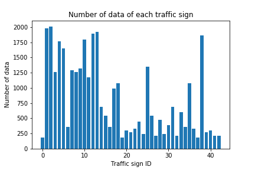
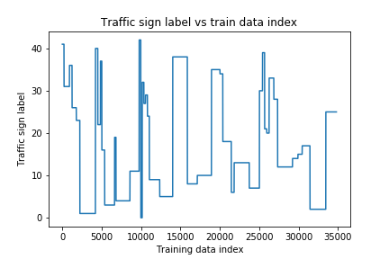
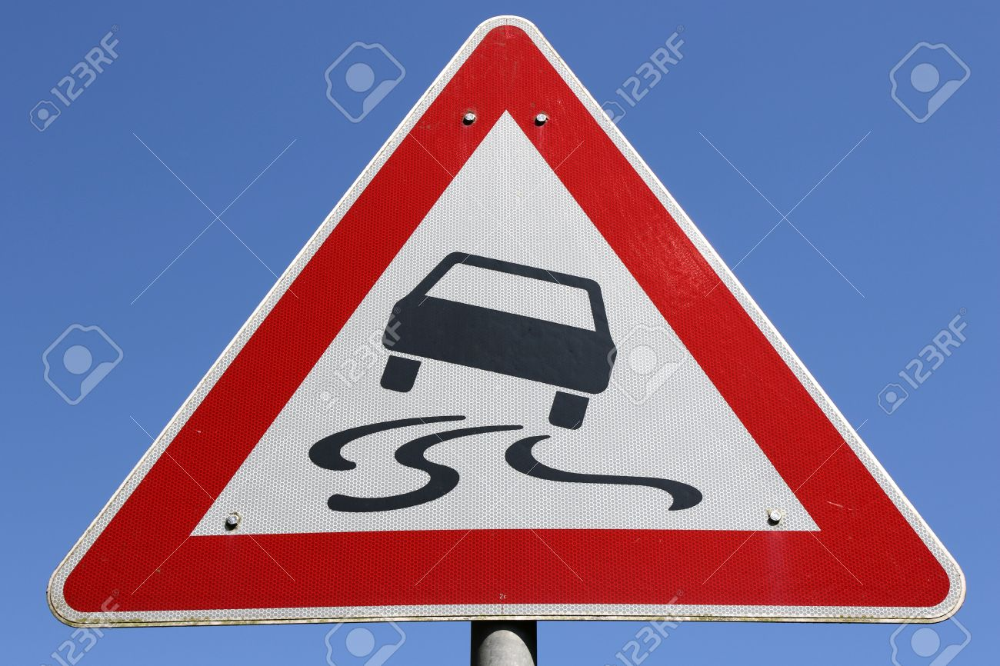
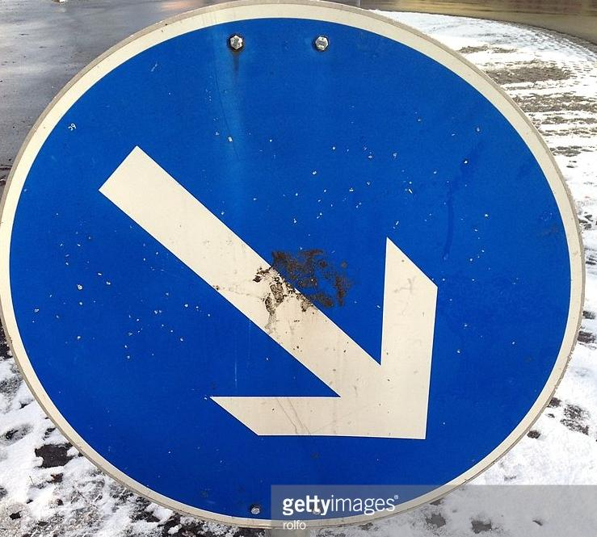
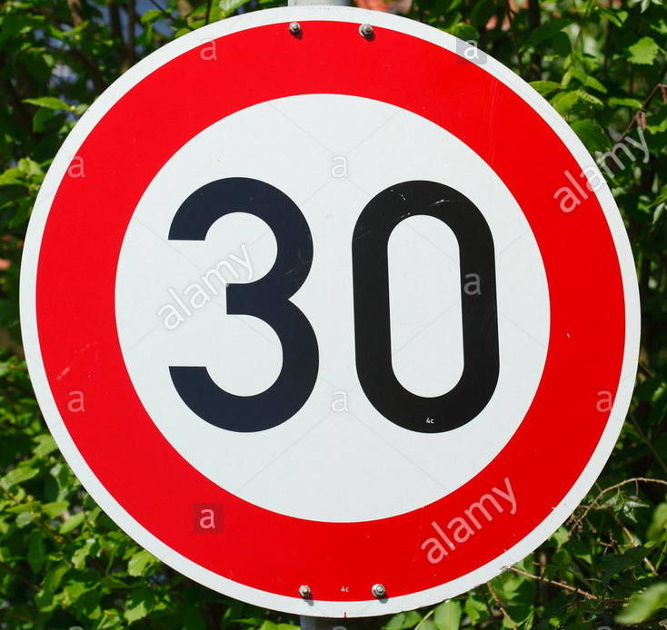
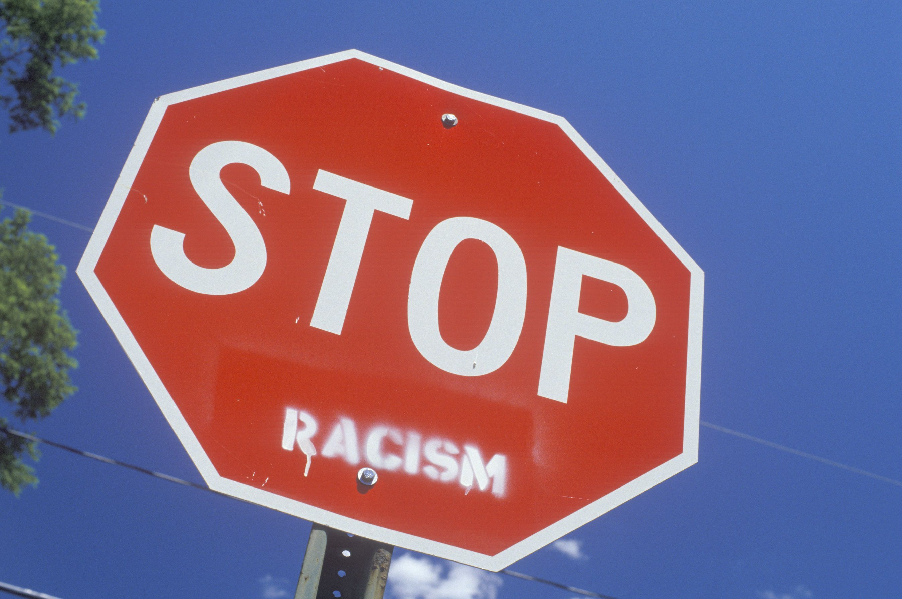
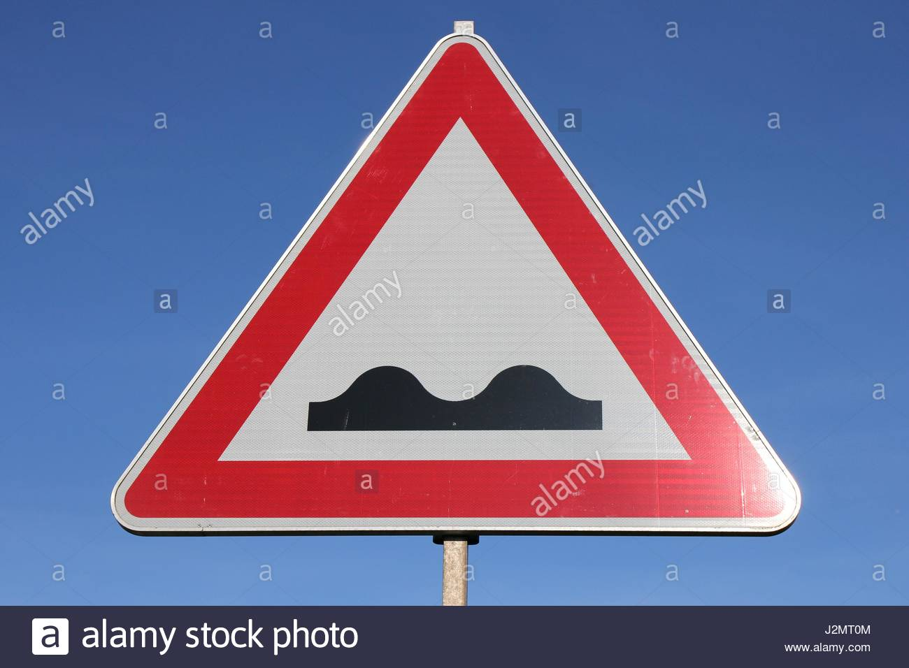
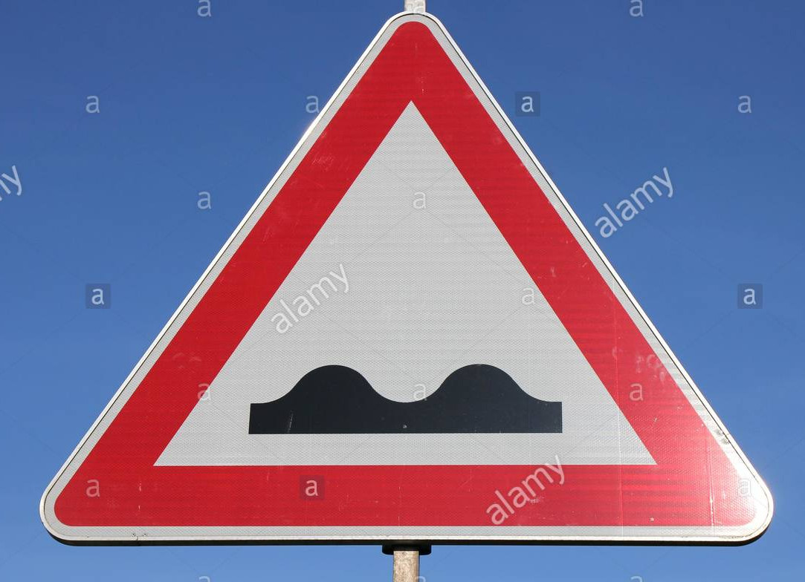

# **Traffic Sign Recognition**

---

[//]: # (Image References)

[image1]: ./examples/visualization.jpg "Visualization"
[image2]: ./examples/grayscale.jpg "Grayscaling"
[image3]: ./examples/random_noise.jpg "Random Noise"
[image4]: ./examples/placeholder.png "Traffic Sign 1"
[image5]: ./examples/placeholder.png "Traffic Sign 2"
[image6]: ./examples/placeholder.png "Traffic Sign 3"
[image7]: ./examples/placeholder.png "Traffic Sign 4"
[image8]: ./examples/placeholder.png "Traffic Sign 5"

## Project link
https://github.com/Po-Hsun-Su/CarND-Traffic-Sign-Classifier-Project

## Rubric Points
### Data Set Summary & Exploration

#### 1. Dataset summary

The following statistics of the traffic signs data set can be calculate from the shape of the numpy array containing the dataset. See the html notebook file for more detail.

* The size of training set is 34799
* The size of the validation set is 4410
* The size of test set is 12630
* The shape of a traffic sign image is (32, 32, 3)
* The number of unique classes/labels in the data set is 43

#### 2. Data set visualization

The following figure shows the number of data samples of each label. We can see that the data is not balanced. Some labels have 6 times more than others.

The following figure shows traffic sign label vs data index. The training dataset contains consecutive data samples of the same label. Shuffling the training dataset is necessary before training. Otherwise, the training process can be unstable.

### Design and Test a Model Architecture

#### 1. Preprocessing

For preprocessing, I only scale the data between [0, 1]. I found that scaling the data to [0, 1] achieves 94% validation accuracy whereas scaling the data to [-1, 1] only produces 80% validation accuracy. This is because the range [0, 1] suits the relu unit.

#### 2. Model architecture

My final model consisted of the following layers:

| Layer         		|     Description	        					|
|:---------------------:|:---------------------------------------------:|
| Input         		| 32x32x3 RGB image   							|
| Convolution 5x5     	| 1x1 stride, no padding, outputs 28x28x16	|
| RELU					|												|
| Max pooling	      	| 2x2 stride,  outputs 14x14x16 				|
| Convolution 5x5	    | 1x1 stride, no padding, outputs 10x10x32	|
| RELU					|												|
| Max pooling	      	| 2x2 stride,  outputs 5x5x32 				|
| Fully connected		| input: 800, output 120        |
| RELU					|												|
| Drop out      |   Drop out probability 0.5    |
| Fully connected		| input: 120, output 43        |
| Softmax				|        									| |

<!-- #### 3. Describe how you trained your model. The discussion can include the type of optimizer, the batch size, number of epochs and any hyperparameters such as learning rate. -->

#### 3. Training

To train the model, I used the Adam optimizer with learning rate 1e-3 and batch size 32. I trained the model until validation accuracy reaches 93%.

<!-- #### 4. Describe the approach taken for finding a solution and getting the validation set accuracy to be at least 0.93. Include in the discussion the results on the training, validation and test sets and where in the code these were calculated. Your approach may have been an iterative process, in which case, outline the steps you took to get to the final solution and why you chose those steps. Perhaps your solution involved an already well known implementation or architecture. In this case, discuss why you think the architecture is suitable for the current problem. -->

#### 4. Training result

My final model results were:
* training set accuracy of 99%
* validation set accuracy of 94.24%
* test set accuracy of ? 93.96%

My first model has the same layers as my final model but without dropout and the input image is scale to [-1, 1]. This model only achieves 99% training accuracy but only 75% validation accuracy. To reduce overfitting, I added the dropout layer and achieves 80% validation accuracy. Surprisingly, the break through is to normalize the input to [0, 1].

### Test a Model on New Images

#### 1. Test images

Here are five German traffic signs that I found on the web:

Because the sign in the training images are all roughly centered, I cropped and centered some of the images.
#### 2. Prediction of the new test images.

Here are the results of the prediction:

| Image			        |     Prediction	        					|
|:---------------------:|:---------------------------------------------:|
| Stop Sign      		| Stop sign   									|
| Slippery road    			| Slippery road 										|
| Keep right					| Keep right											|
| Road work	      		| Road work					 				|
| Speed limit 30 km/h			| Speed limit 30km/h      							|
| Stop | Stop |
| Right-of-way at the next intersection | Right-of-way at the next intersection |
| Bumpy road | Children crossing |
| Bumpy road | Bumpy road |
The model was able to correctly guess 8 of the 9 traffic signs, which gives an accuracy of 88.9%. This compares favorably to the accuracy on the test set of 93%.

The only wrong prediction is the 8th image. I suspect that the watermark might be the cause so I crop the 8th image again and produce the 9th image. After the second crop, my model is able to predict the correct label. This implies that the model still overfit the training set to some extent and a slight modification of the appearance of the image can causes wrong prediction.

#### 3. Top 5 softmax probability

The code for making predictions on my final model is located in the last cell of the Ipython notebook.

My model is very confident to all is prediction. The softmax probability of every correct prediction is 1. Even the top-1 probability of the wrong prediction of the 8th image is 0.99. This is because my training algorithm maximize the log of the softmax probability and prefer confident prediction. To address this overconfidence problem, I can add weight decay in training.
